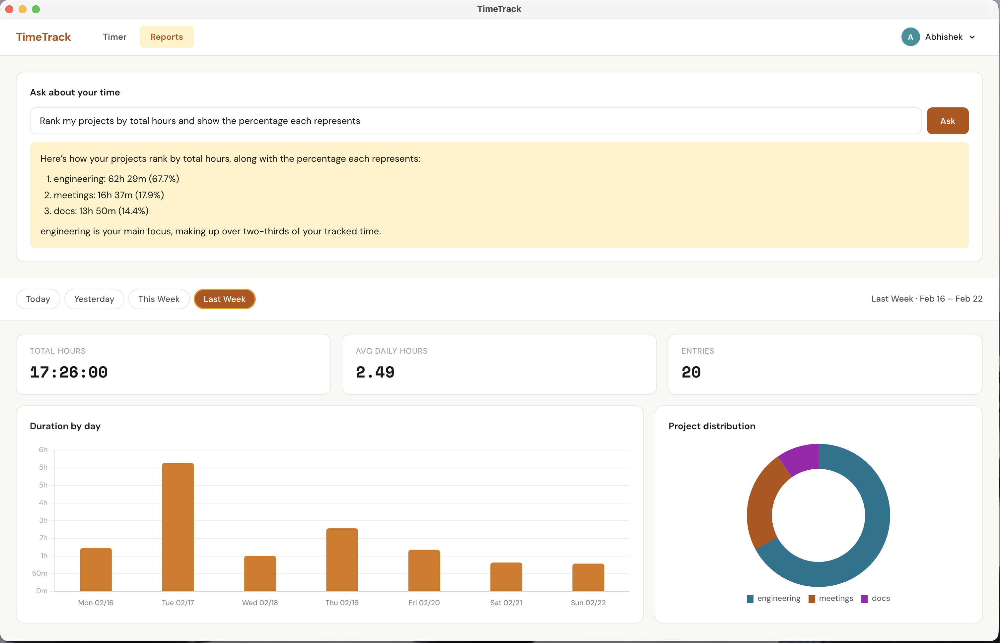
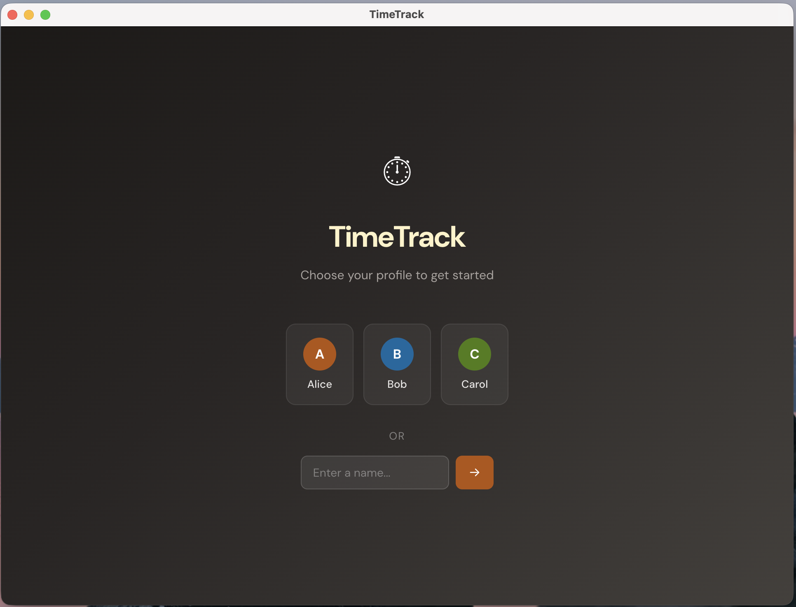
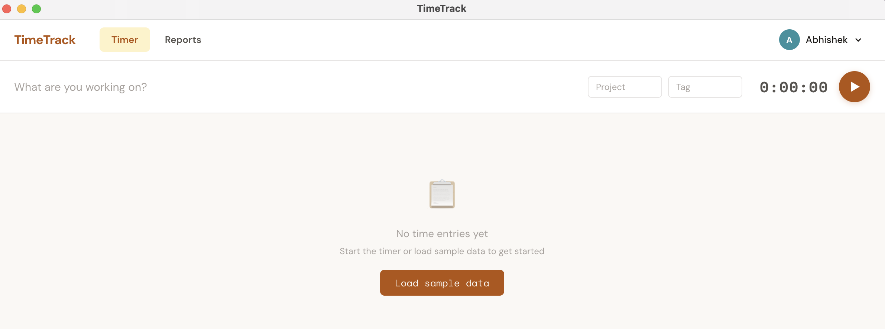
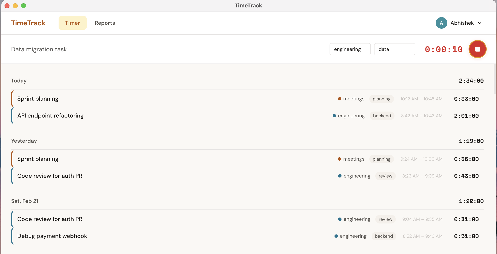
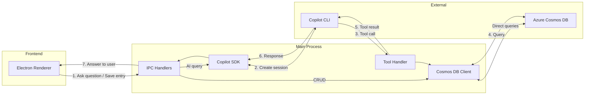

# TimeTrack app - A time tracking Electron app built with the GitHub Copilot SDK and Azure Cosmos DB

The [GitHub Copilot SDK](https://github.com/github/copilot-sdk) lets you embed Copilot's agentic workflows directly into your apps and it's available for Python, TypeScript, Go, and .NET.

**TimeTrack** is an Electron based time tracking desktop app built with the GitHub Copilot SDK (TypeScript) and [Azure Cosmos DB](https://learn.microsoft.com/en-us/azure/cosmos-db/introduction).

You can:

- Track time with a start/stop timer, projects, and tags
- View entries, reports, and charts across multiple users
- Ask natural language questions about your time data — Copilot generates and runs Cosmos DB SQL queries automatically
- Seed realistic sample data to explore the app immediately

<a href="https://abhirockzz.github.io/videos/timetrack_app_demo.mp4" target="_blank">
  
</a>

## Highlights

- **🔧 Tool calling with Copilot SDK** — The app uses the SDK's [`defineTool`](https://github.com/github/copilot-sdk/tree/main/nodejs#tools) API to register a database query tool that the AI calls autonomously. When a user asks a question in plain English, the SDK reasons about it, generates a Cosmos DB SQL query, executes it via the tool, and returns a conversational answer.

- **🔑 BYOK (Bring Your Own Key)** — The Copilot SDK's [BYOK](https://github.com/github/copilot-sdk/blob/main/docs/guides/setup/byok.md) support lets you swap the default Copilot model for your own deployment. This app supports Azure AI Foundry and local OpenAI-compatible servers (Ollama, Foundry Local) — just configure a few env vars and the app behavior stays identical.

- **💻 Local mode** — You can run the app without an Azure account by using the [Cosmos DB vNext emulator](https://learn.microsoft.com/en-us/azure/cosmos-db/emulator-linux). It runs as a single Docker container with HTTP (no TLS setup) and includes a built-in Data Explorer UI at `http://localhost:1234` for browsing your data.

## Prerequisites

1. [Node.js 22+](https://nodejs.org/) (system-installed, required by the Copilot CLI)
2. **GitHub Copilot CLI** — [install it](https://docs.github.com/en/copilot/how-tos/set-up/install-copilot-cli) and login
3. **One of the following for Cosmos DB:**
   - **Azure**: Azure CLI + Azure Cosmos DB account
   - **Run locally**: [Cosmos DB vNext emulator](https://learn.microsoft.com/en-us/azure/cosmos-db/emulator-linux) (Docker)

## Clone the Repository

```bash
git clone https://github.com/abhirockzz/cosmosdb-copilot-sdk-time-tracker.git

cd cosmosdb-copilot-sdk-time-tracker

npm install
```

---

## Option A: Using Azure Cosmos DB

### 1. Create Cosmos DB Resources

```bash
az login

export RG_NAME="timetracker-rg"
export COSMOS_ACCOUNT="timetracker-cosmos"
export LOCATION="westus2"

az group create --name $RG_NAME --location $LOCATION

az cosmosdb create \
  --name $COSMOS_ACCOUNT \
  --resource-group $RG_NAME \
  --kind GlobalDocumentDB

az cosmosdb sql database create \
  --account-name $COSMOS_ACCOUNT \
  --resource-group $RG_NAME \
  --name timetracker

az cosmosdb sql container create \
  --account-name $COSMOS_ACCOUNT \
  --resource-group $RG_NAME \
  --database-name timetracker \
  --name timeEntries \
  --partition-key-path /userId
```

### 2. Assign RBAC Role

```bash
USER_ID=$(az ad signed-in-user show --query id -o tsv)
COSMOS_ID=$(az cosmosdb show --name $COSMOS_ACCOUNT --resource-group $RG_NAME --query id -o tsv)

az cosmosdb sql role assignment create \
  --account-name $COSMOS_ACCOUNT \
  --resource-group $RG_NAME \
  --role-definition-name "Cosmos DB Built-in Data Contributor" \
  --principal-id $USER_ID \
  --scope $COSMOS_ID
```

### 3. Run the App

```bash
cp .env.example .env
# Edit .env — set COSMOS_ACCOUNT to your account endpoint

npm start
```

Skip to [Use the App](#use-the-app) section below.

---

## Option B: Using the Cosmos DB vNext Emulator

The vNext emulator [runs on Linux/macOS/Windows via Docker](https://learn.microsoft.com/en-us/azure/cosmos-db/emulator-linux) without the need for an Azure account.

### 1. Start the Emulator

```bash
docker run -p 8081:8081 -p 1234:1234 mcr.microsoft.com/cosmosdb/linux/azure-cosmos-emulator:vnext-preview
```

### 2. Create Database and Container

Open the Data Explorer at http://localhost:1234 and create:

- Database: `timetracker`
- Container: `timeEntries` with partition key `/userId`

### 3. Run the App

```bash
cp .env.example .env
```

Set `USE_EMULATOR=true` in your `.env`:

```bash
USE_EMULATOR=true
npm install
npm start
# COSMOS_ACCOUNT is not needed when using the emulator
```

---

## Use the App

**Login** — Select a user (alice, bob, or carol) or enter the name of a custom user



> This is simply to simulate multiple users in the app. There is no authentication or security — all data is stored in the same Cosmos DB container and scoped by `userId`.

**Load sample data** — Click "Load sample data" on first login to seed activity data for the user.



**Track time** — Start/stop a timer with project and tag selection



**Ask questions** — Use the AI chat to query your time data in natural language. The AI generates Cosmos DB SQL behind the scenes, so you can ask things that go well beyond the fixed reports:

- *Do I tend to work longer hours early in the week or late in the week?*
- *How does my Monday workload compare to my Friday workload?*
- *Compare my total hours this week vs last week*
- *Which single task consumed the most total time across all days?*
- *Rank my projects by total hours and show the percentage each represents*
- *Summarize my last two weeks in 3 bullet points*

**View reports** — Charts and summaries for Today, Yesterday, This Week, Last Week

---

## How It Works



### AI-Generated SQL Queries

When you ask a natural language question like *"how productive was I this week?"*, the app uses the Copilot SDK's `defineTool` API to let the AI generate and execute Cosmos DB SQL queries:

```typescript
const queryTool = defineTool("query_time_data", {
  description: "Execute a read-only Cosmos DB SQL query...",
  parameters: z.object({
    query: z.string().describe("Cosmos DB SQL query"),
  }),
  handler: async ({ query }) => {
    const result = await runQuery(userId, query);
    return JSON.stringify(result);
  },
});

session = await client.createSession({
  tools: [queryTool],
  systemMessage: { mode: "replace", content: "..." },
});
```

The AI translates intent into SQL, runs it against your data (scoped to the current user's partition key), and summarizes the results conversationally. If the generated SQL hits a Cosmos DB error (e.g., unsupported syntax like `ORDER BY` on an aggregate alias), the error is returned to the model, which self-corrects and retries with fixed SQL — typically succeeding within 1–2 attempts, with no user intervention needed.

### Direct Cosmos DB Operations

Not everything goes through the AI. Saving a time entry, loading the dashboard, and seeding sample data all talk to Cosmos DB directly — no LLM round-trip needed. The renderer calls Electron IPC handlers that invoke `saveEntry()`, `queryEntries()`, and `bulkCreateEntries()` straight from `cosmos.ts`. Seeding generates ~100 realistic entries spanning 30 days and batch-inserts them using the Cosmos DB batch API, partitioned by `userId`. The AI only gets involved when you ask a natural language question — everything else is a standard database call.

---

## Model Selection

By default, the app uses `gpt-4.1` via GitHub Copilot. You can change this to any [supported Copilot model](https://docs.github.com/en/copilot/reference/ai-models/supported-models) (e.g., `gpt-5`, `claude-sonnet-4.5`) by setting `COPILOT_MODEL` in your `.env`:

```bash
COPILOT_MODEL=claude-sonnet-4.5
```

## BYOK — Bring Your Own Model (optional)

If you want to use a model outside of Copilot's lineup, you can bring your own via [BYOK](https://github.com/github/copilot-sdk/blob/main/docs/guides/setup/byok.md). You control the identity layer, the model provider, and the billing — the SDK provides the agent runtime.

Two options are supported:

### Option A: Azure AI Foundry

To create and deploy a model in Azure AI Foundry, follow [Create and deploy an Azure OpenAI in Azure AI Foundry Models resource](https://learn.microsoft.com/azure/ai-foundry/openai/how-to/create-resource).

Use your deployment name as `BYOK_AZURE_MODEL`.

```bash
BYOK_AZURE_ENDPOINT=https://your-resource.openai.azure.com
BYOK_AZURE_API_KEY=your-api-key
BYOK_AZURE_MODEL=gpt-4.1            # your deployment name
BYOK_AZURE_API_VERSION=2024-10-21   # optional
```

> **Note:** Use just the host for `BYOK_AZURE_ENDPOINT` (e.g. `https://your-resource.openai.azure.com`). Do not include `/openai/v1/` or other paths — the SDK constructs the full URL automatically.

### Option B: Local model (Ollama / Foundry Local) — experimental

The app also supports local OpenAI-compatible model servers. Set these in `.env`:

```bash
BYOK_LOCAL_URL=http://localhost:11434/v1   # Ollama, or http://127.0.0.1:5272/v1 for Foundry Local
BYOK_LOCAL_MODEL=qwen3                      # must support tool/function calling
# BYOK_LOCAL_API_KEY=                       # optional
```

**Caveats:**

- This app relies on tool/function calling — most small local models either don't support it or produce unreliable results (hallucinated data instead of calling tools).
- Inference is significantly slower than cloud models. Timeout is auto-increased to 180s.
- You need a capable GPU and a model that reliably handles tool calls (e.g., `qwen3` on Ollama, `qwen2.5-7b` on Foundry Local).
- See [Ollama docs](https://docs.ollama.com/quickstart) and [Foundry Local docs](https://learn.microsoft.com/en-us/azure/ai-foundry/foundry-local/get-started) for installation and setup.

When any BYOK vars are set, the app routes AI queries to that provider. When unset, it uses the default Copilot model.

---

## Cosmos DB Data Model

**Container**: `timeEntries` | **Partition key**: `/userId`

```json
{
  "id": "uuid",
  "userId": "alice",
  "description": "API endpoint refactoring",
  "project": "engineering",
  "tag": "backend",
  "startTime": "2026-02-22T09:00:00Z",
  "stopTime": "2026-02-22T10:30:00Z",
  "duration": 5400
}
```

